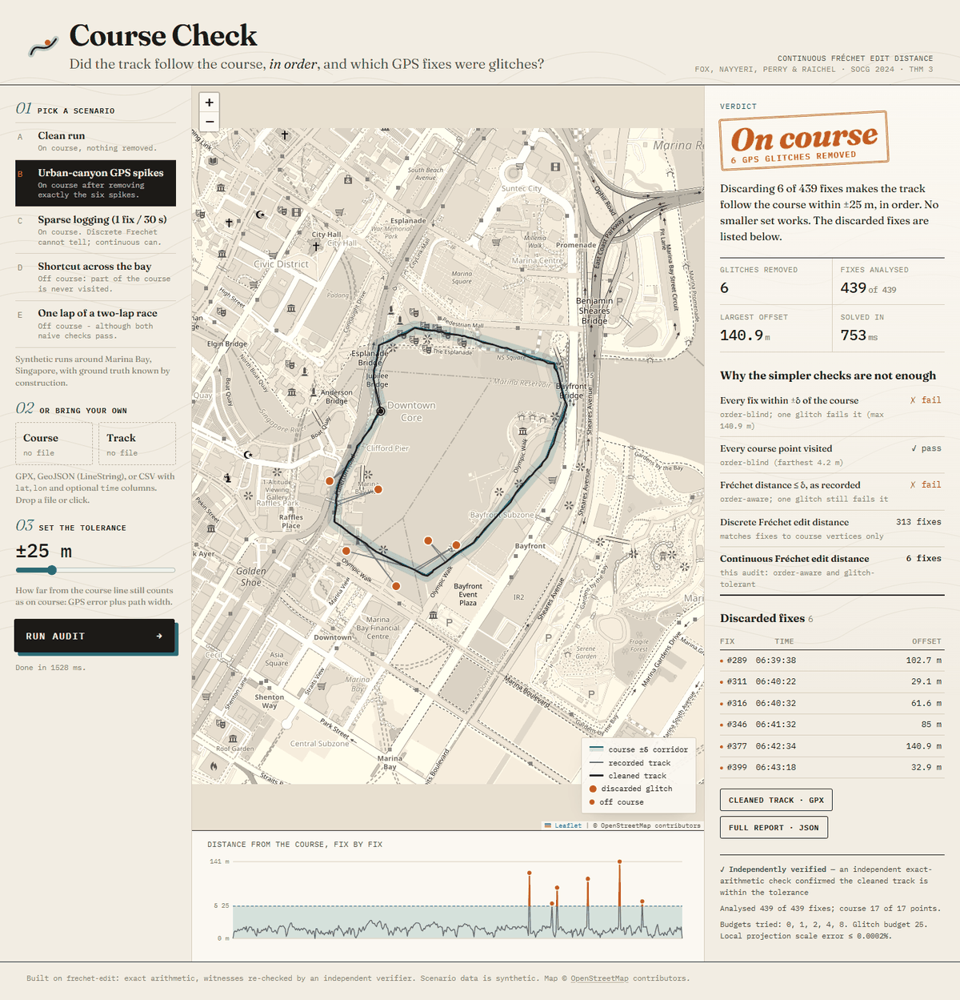

# Course Check: the web app

A real-world use of the library: **did a GPS track follow a planned course, in
order, and which fixes were glitches?** It lives in `webapp/` and is not part of
the installed `frechet-edit` package.



## The problem it solves

Race organisers (virtual races, orienteering, ultras), coaches and fleet
operators all ask the same question of a recorded GPS track: *did it follow the
course?* The obvious checks fail in opposite directions.

| check | fails because |
|---|---|
| every fix within δ of the course | one multipath spike in a city fails a perfect run |
| every course point visited | order-blind: a runner who does 1 lap of a 2-lap race passes |
| ordinary Fréchet distance ≤ δ | order-aware, but one spike still fails it |
| discrete Fréchet (edit) distance | matches fixes to course *vertices*; a sparse course polyline against dense fixes looks wildly off (311 "deletions" for a clean run) |

The engine here is **continuous Fréchet edit distance, deletions only** (Fox,
Nayyeri, Perry and Raichel, SoCG 2024, Section 4.1, Theorem 3), implemented in
`frechet_edit.continuous_edit_distance`. It asks:

> What is the fewest GPS fixes to discard so that the rest of the track stays
> within δ metres of the course, continuously and in order, from start to
> finish?

* **0**: on course as recorded.
* **a few**: on course; those fixes were glitches, and the app names them.
* **no solution within the glitch budget**: the track really left the course
  (a shortcut, a skipped section, a missing lap).

Every "on course" answer comes with a witness (the cleaned track), which an
independent exact-arithmetic verifier re-checks before the page says so.

## Run it

```bash
# once, from the repository root
python -m venv .venv
.venv\Scripts\activate            # macOS/Linux: source .venv/bin/activate
pip install -e ".[dev,app]"

python -m webapp                  # serves http://127.0.0.1:8000
python -m webapp --port 8765      # another port
```

It binds to `127.0.0.1` only. `--host 0.0.0.0` exposes it on your network; do
that only on a network you trust (see *Security*).

## Try it by hand (5 minutes)

1. Open http://127.0.0.1:8000.
2. **A · Clean run** → *Run audit*. Expect a green **On course** stamp, 0
   glitches, and in the comparison table *Discrete Fréchet edit distance: 311
   fixes*: the discrete measure cannot handle a sparse course polyline.
3. **B · Urban-canyon GPS spikes** → *Run audit*. Expect an orange stamp,
   **6 GPS glitches removed**. The ledger lists fixes #289, #311, #316, #346,
   #377, #399, exactly the six the scenario injected. Click a ledger row to fly
   to it on the map. Hover the trace strip under the map, or focus it and use
   ← / →, to step through fixes. *Cleaned track · GPX* downloads the track
   minus those six fixes.
4. **C · Sparse logging** → one fix every 30 s. **On course**, while discrete
   says *impossible*.
5. **D · Shortcut across the bay** → **Off course**. Red dashed rings mark
   course points never approached; red dots are the cut-across fixes; the trace
   shows one long red hump, a route rather than a glitch.
6. **E · One lap of a two-lap race** → **Off course**, although the table shows
   both naive checks **passing**. This is the case that needs an order-aware
   measure.
7. Move the tolerance slider and re-run. Set below the GPS noise floor, the
   tolerance turns noise into "glitches": the clean run needs 3 discards at
   ±8 m and reads as **Off course** at ±5 m (the simulated noise is about 3 m
   and strongly correlated). At ±100 m the shortcut still fails, because a
   missing section is not a tolerance problem.
8. **Upload.** Drag `webapp/samples/marina-bay-course.gpx` onto *Course* and
   `webapp/samples/urban-canyon-track.csv` onto *Track*, then run: the same six
   glitches. Also try `shortcut-track.gpx`, `sparse-track.csv`, and the GeoJSON
   course.
9. **Your own data.** Export a GPX from Strava, Garmin Connect, Komoot or a
   phone app. Use a planned route (or a clean previous recording) as *Course*
   and an activity as *Track*. Long recordings are decimated and dense courses
   simplified to keep an audit to a few seconds; the report's fine print always
   says so.
10. **Bad input.** Upload a text file renamed `.gpx`: the drop zone reports
    "not well-formed GPX" and the Run button stays disabled.

## Test it

```bash
# library + web app + browser tests, fast (~1.5 min). Browser tests SKIP with
# a reason if Playwright or a browser is missing; they never silently pass.
pytest -q -m "not slow"
pytest -q -m "not slow and not e2e"       # the same, without a browser

# only the web app: parsing, audits on known scenarios, the HTTP API
pytest -q webapp/tests

# real-browser end-to-end tests (Playwright driving Edge, or Chrome)
pip install -e ".[e2e]"
pytest -m e2e webapp/tests/test_e2e.py -v
set E2E_BROWSER_CHANNEL=chrome    # PowerShell: $env:E2E_BROWSER_CHANNEL="chrome"
# or: playwright install chromium  &&  set E2E_BROWSER_CHANNEL=chromium

# exhaustive oracle tier for the library (~5 min)
pytest -q -m slow

# lint and types
ruff check src tests experiments benchmarks examples webapp
mypy
```

What each layer proves:

| file | what it checks |
|---|---|
| `webapp/tests/test_geo.py` | GPX/GeoJSON/CSV parsing, hostile XML refused, coordinate validation, projection accuracy against the great circle (≤ 1e-5 relative), antimeridian, Douglas-Peucker bound, committed samples up to date |
| `webapp/tests/test_audit.py` | each scenario's verdict; urban-canyon finds **exactly** the injected indices; one-lap-of-two passes both naive checks yet fails; decimation, simplification and budgets are disclosed |
| `webapp/tests/test_server.py` | response envelope, 404/413/422/400/503 paths, security headers and CSP on every response, safe download filenames, no exposed API docs |
| `webapp/tests/test_e2e.py` | the real page under the real CSP: scenario flows, uploads of the sample files, error display, keyboard navigation of the trace, GPX download, no horizontal scroll at 390 px, no console errors or failed asset requests |

The engine underneath has its own evidence: `docs/continuous.md` section 5.

## API

Every JSON response is `{"success": bool, "data": ..., "error": str | null}`.

| method and path | body | returns |
|---|---|---|
| `GET /api/health` | - | `{status, frechet_edit}` |
| `GET /api/scenarios` | - | the catalogue |
| `GET /api/scenarios/{id}` | - | course, track, recommended `delta_m`, injected glitch indices |
| `POST /api/parse` | multipart `file` (≤ 5 MB) | `{name, points: [{lat, lon, time}]}` |
| `POST /api/audit` | `{course: [{lat, lon, time?}], track: [...], delta_m}` | verdict, glitches, cleaned track, per-fix offsets, checks, verification, processing notes |
| `POST /api/gpx` | `{name, points}` | a GPX 1.1 download |

```bash
curl -s http://127.0.0.1:8000/api/scenarios/urban-canyon > sc.json
python - <<'EOF'
import json, urllib.request
sc = json.load(open("sc.json"))["data"]
body = json.dumps({"course": sc["course"], "track": sc["track"], "delta_m": 25}).encode()
req = urllib.request.Request("http://127.0.0.1:8000/api/audit", body,
                             {"Content-Type": "application/json"})
print(json.load(urllib.request.urlopen(req))["data"]["verdict"])
EOF
```

## How an audit is computed

1. Validate positions (finite, in range, |latitude| ≤ 80°, extent ≤ 100 km).
2. Project course and track to a local tangent plane, in metres, at the
   course's centre. The reported scale error is below 0.001 % for a city-sized
   route.
3. Bound the work: simplify a dense course by Douglas-Peucker to at most 150
   vertices, within δ/4, refusing rather than distorting further; decimate a
   long track to at most 600 fixes; cap the glitch budget at 25. All three are
   reported.
4. `continuous_edit_distance(course, track, δ, max_deletions=budget,
   return_witness=True)`: budgets 0, 1, 2, 4, … until one succeeds.
5. Re-check the cleaned track with `verify_witness`, an exact Alt-Godau sweep
   that shares no code with the solver, when the input is small enough to do so
   inside the request (≤ 40 000 free-space cells); otherwise the report says it
   was skipped.
6. Explain a negative verdict from the geometry: uncovered course points,
   the longest off-corridor stretch, or neither (an order problem).

## Limits, honestly

* **Scenario data is synthetic.** The course is drawn from approximate landmark
  coordinates around Marina Bay; it does not follow real footpaths exactly, and
  it crosses buildings in places. Tracks are simulated with correlated GPS
  noise. Nothing here is a real person's data.
* **δ is a modelling choice.** Too small and GPS noise reads as glitches; too
  large and a short cut reads as on course.
* **An edit objective cannot tell noise from intent.** A short genuine detour
  of a few fixes looks exactly like a glitch cluster; the glitch budget and
  your judgement decide. See `docs/limitations.md`.
* **Budget, not proof.** "Off course" with "more than 25 fixes" means no
  solution within the budget, not that none exists at any size.
* **Work bounds.** At 150 course vertices × 600 fixes with a budget of 25 an
  audit takes a few seconds; the demo scenarios take 0.1–1.6 s.
* Map tiles come from OpenStreetMap and need the internet; everything else,
  Leaflet included, is served locally.

## Security

Proportionate to a tool meant for localhost:

* **Sizes.** Request bodies are capped at 8 MB by counting the bytes actually
  received, so a chunked body without `Content-Length` is cut off rather than
  buffered (a 524 MB chunked push left the server at 84 MB peak). Uploads are
  capped at 5 MB, curves at 50 000 points.
* **Work.** Every audit is bounded in duration as well as number: at most two
  run at once (a third gets HTTP 503), and course simplification is bounded
  (each Douglas-Peucker attempt stops once it keeps too many points, and all
  attempts share a work budget), so no input inside the limits can pin a
  worker for minutes.
* **Parsing.** XML with a DOCTYPE or entity declaration is refused before
  parsing.
* **Browsers.** A browser POST from another site is refused (`Sec-Fetch-Site`),
  which closes drive-by multipart uploads; curl and scripts are unaffected.
  Responses carry a strict Content-Security-Policy (`script-src 'self'`, no
  inline or eval), `nosniff` and `DENY` framing. User-supplied text reaches the
  page only through `textContent`, and map tooltips are text-only nodes.
* Internal errors are logged, never echoed. There is no authentication:
  don't expose it to the internet.

An independent security review found three problems, all fixed and pinned by
tests in `webapp/tests/test_server.py::TestSecurityReviewFindings` and
`test_geo.py::TestSimplificationCannotBeWeaponised`: an O(n^2)
Douglas-Peucker worst case (a 50 000-point square wave took 315 s; now 0.7 s
end to end), a chunked-body bypass of the size cap, and cross-site multipart
POSTs. It found no XXE bypass, header injection, path traversal, XSS or error
leakage.

## Files

```
webapp/
  __main__.py      python -m webapp
  server.py        FastAPI routes, limits, security headers
  audit.py         the audit: engine call, checks, verdict, verification
  geo.py           parsing, validation, projection, simplification
  scenarios.py     the five synthetic scenarios (ground truth by construction)
  make_samples.py  regenerates webapp/samples/
  samples/         GPX / CSV / GeoJSON files to try uploads with
  static/          index.html, app.js, styles.css, vendor/leaflet (BSD-2)
  tests/           unit, API and browser tests
```
